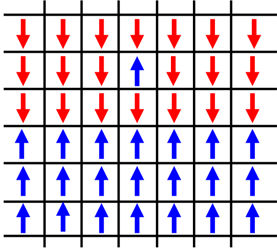
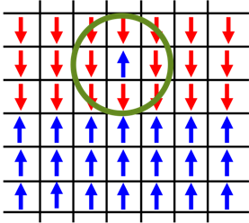
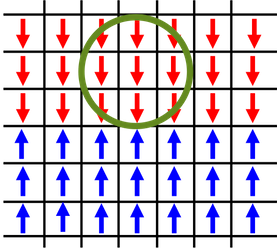
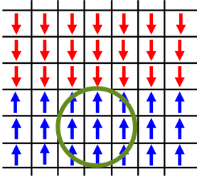
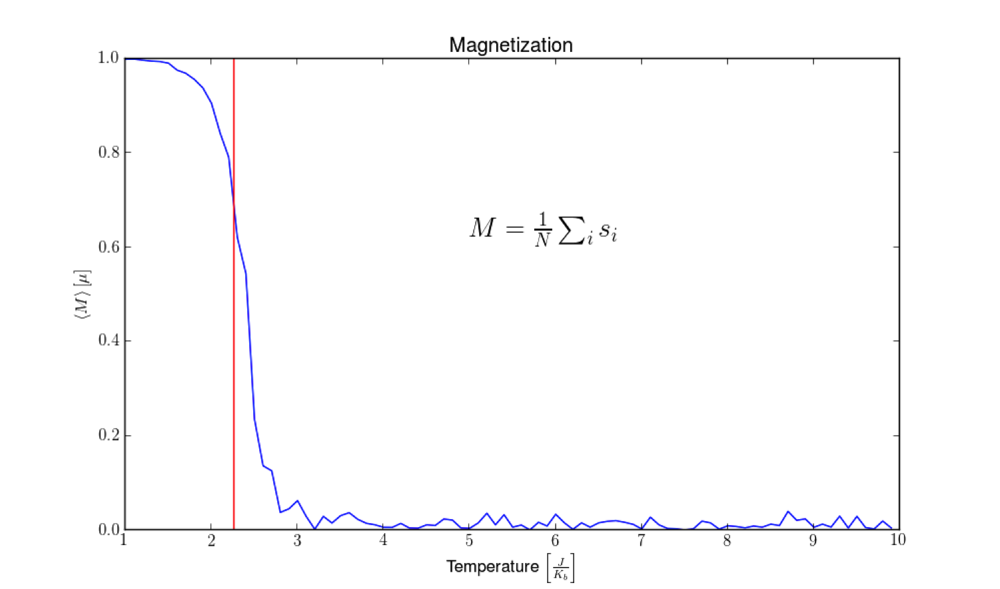
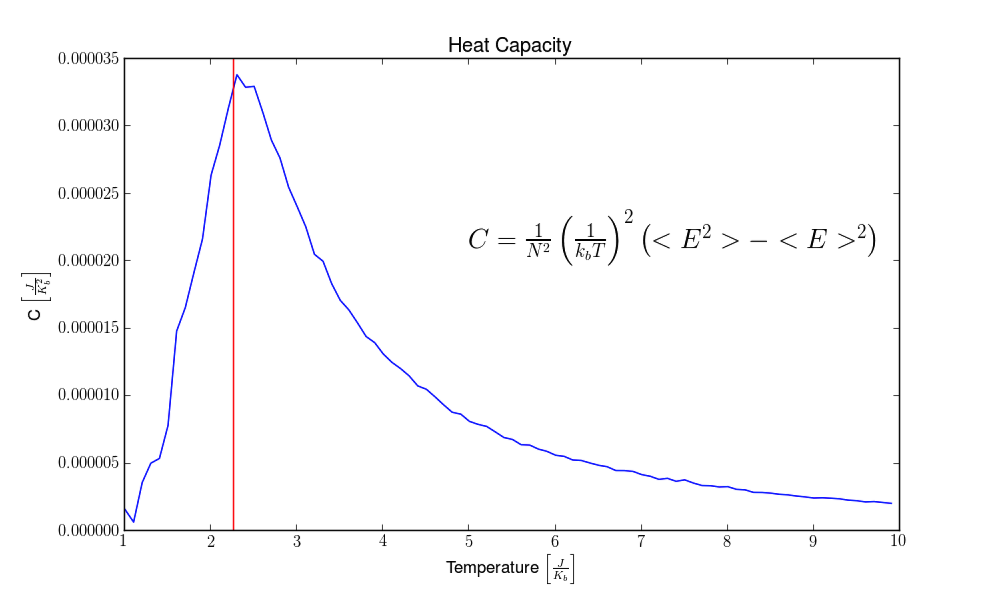
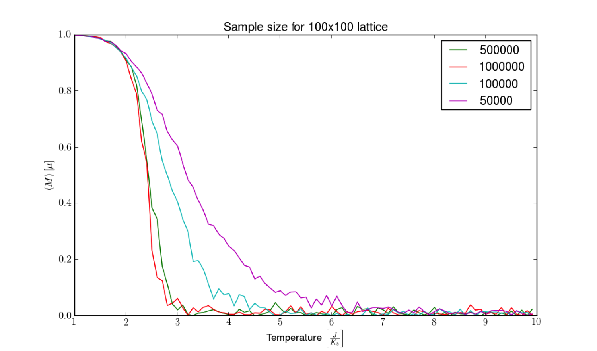

The Ising Model is a simplified version of a ferromagnet - where the structure of the material consist of a single dipole per lattice site. The overall magnetization of the material is determined by the number of dipoles that are aligned parallel to one-another. The Ising Model is a beautifully simpl demonstration of the implications of statistical mechanics and phase transitions - as well a being an fantastic example of the power of Monte Carlo Simulations. This post covers running the metropolis algorithm for the classical Ising model.

We start with a macroscopic state, state '\\( f \\)', of the Ising-Ferromagnet; the bottom half of the material is aligned with each microscopic state in spin-up and the top half is aligned with spin-down, with the exception of one dipole who's spin-up - anti-parallel to it's neighbors. 

A microscopic state is selected at random. Lets say we land on the state aligned anti-parallel to it's neighbors.

The change in energy of the system is dictated by the interaction of a dipole with its neighbors [eq. 1]. 

$$
\begin{equation}
\Delta E=-2J\sum_{k}s_{l}s_{k}
\end{equation}
$$

If the spin of this dipole were to be reversed: 

the energy of the system would change by:

$$
\Delta E=-8J
$$

thus creating a new macroscopic state,  state '\\( f' \\)'. Because the change in energy is negative, and we know that energy will be at a minimum for equilibrium, we'll accept the change,  '\\( f = f' \\)': 

we then randomly select another dipole in the system.

Again, we calculate the change in energy if this state were to flip '\\( f \rightarrow f' \\)'. In this case the energy is positive, \\( \Delta E=8J \\). This is still a possible state for the system to be in, however improbable. So we calculate the ratio of transition probabilities based on the partition function of the system

$$
\begin{equation}
\frac{P(f\rightarrow f')}{P(f' \rightarrow f)}=\frac{e^{-\beta E_{2}}}{e^{-\beta E_{1}}}=e^{-\beta \Delta E}
\end{equation}
$$

We determine this transition by "rolling the dice". If this ratio is greater than a random number, \\( x \\), between 0 and 1 we accept the new state. Otherwise, we reject it, and keep the original state

$$
f=\left\{\begin{matrix}
f' & e^{-\beta \Delta E } \geq x \\ 
f & e^{-\beta \Delta E } <  x
\end{matrix}\right.
$$

In terms of computer code, this is all very simple. It's just a 'for loop' with a few 'if' statements. Attached bellow is a basic python script of simulating this model. 

~~~python
#----------------------------------------------------------------------#
#   Check periodic boundary conditions 
#----------------------------------------------------------------------#
def bc(i):
    if i+1 > SIZE-1:
        return 0
    if i-1 < 0:
        return SIZE-1
    else:
        return i

#----------------------------------------------------------------------#
#   Calculate internal energy
#----------------------------------------------------------------------#
def energy(system, N, M):
    return -1 * system[N,M] * (system[bc(N-1), M] \\
                               + system[bc(N+1), M] \\
                               + system[N, bc(M-1)] \\
                               + system[N, bc(M+1)])

#----------------------------------------------------------------------#
#   Build the system
#----------------------------------------------------------------------#
def build_system():
    system = np.random.random_integers(0,1,(SIZE,SIZE))
    system[system==0] =- 1

    return system

#----------------------------------------------------------------------#
#   The Main monte carlo loop
#----------------------------------------------------------------------#
def main(T):
    system = build_system()

    for step, x in enumerate(range(STEPS)):
        M = np.random.randint(0,SIZE)
        N = np.random.randint(0,SIZE)

        E = -2. * energy(system, N, M)
        
        if E <= 0.:
            system[N,M] *= -1
        elif np.exp(-1./T*E) > np.random.rand():
            system[N,M] *= -1

#----------------------------------------------------------------------#
#   Run the menu for the monte carlo simulation
#----------------------------------------------------------------------#
def run():
    print '='*70
    print '\tMonte Carlo Statistics for an ising model with'
    print '\t\tperiodic boundary conditions'
    print '='*70

    print "Choose the temperature for your run (0.1-100)"
    T = float(raw_input())
    main(T)

~~~

Using the above code, this is a simulation of a 150x150 lattice in the high temperature limit, \\( T = 10 \frac{J}{KB} \\). 
with \\( 10^{6} \\) samplings 

<video controls>
  <source src="media/highT.webm" type="video/webm">
  <source src="media/highT.mp4" type="video/mp4">
  Your browser does not support the <code>video</code> element.
</video>

The system remains highly disordered and the net magnetization \\( \approx  0 \\). 

In comparison, this is the same simulation, but now at a low temperature limit, \\( T = 0.1 \frac {J}{KB} \\). As the simulation progresses the interaction between the spins dominates  and  causes alignment. Distinct phases appear in the model.

<video controls>
  <source src="media/lowT.webm" type="video/webm">
  <source src="media/lowT.mp4" type="video/mp4">
  Your browser does not support the <code>video</code> element.
</video>

Given enough time, the system will become fully magnetized. 

We expect there is some temperature at which this phase transition happens - where the systems goes from being a Ferromagent to a Paramagnet. This temperature was solved for exactly by Lars Onsager in 1944. 

$$
\begin{equation}
\frac{K_{b}T_{c}}{J}=\frac{2}{ln(1+\sqrt{2})}\approx 2.269
\end{equation}
$$

His solution, although elegant, is immensely complicated. We're going to use the monte carlo method to see the effects that his solution describes. 

The above graph is the result of running the Ising simulation at incrementing temperatures, and calculating the magnetization. As you can see, the magnetization quickly drops from 1 to 0 right around 2.269 given in eqn. 3 and marked by the red line.

In conjunction, we see the Heat capacity of the system spikes at this same temperature. 

In the same way that as water boils on the stove top, it doesn't matter how much energy you pump into the system, the temperature will remain the same during a phase transition.

We've been able to gain a detailed understanding of the behavior of the Ising model through this method, and we've done it without any calculus. All we did was set the boundary conditions of the system, and let the computer carry out the the behavior of nature with good old fashion brute force. I find this pretty incredible. 

*One thing to note:* The results of this simulation (and monte carlo simulations in general) are very depended on the computation time, and the size of the system you work with. In the video showing the low temperature limit we saw distinct phases form in the model. However, it womediauld require a significant amount of time for the model to become completely magnetized in one direction or the other. For the simulations of magnetization and heat capacity: I started with the system in a fully magnetized state, and watched for what temperature it deteriorated. To show the effect run time has on this, bellow is a graph of the magnetization of the system for different sampling numbers. 

As you can see, it has a big effect on the reliability of the results. In practice, these codes are run on enormous super computers for months at a time to generate trusted results.

